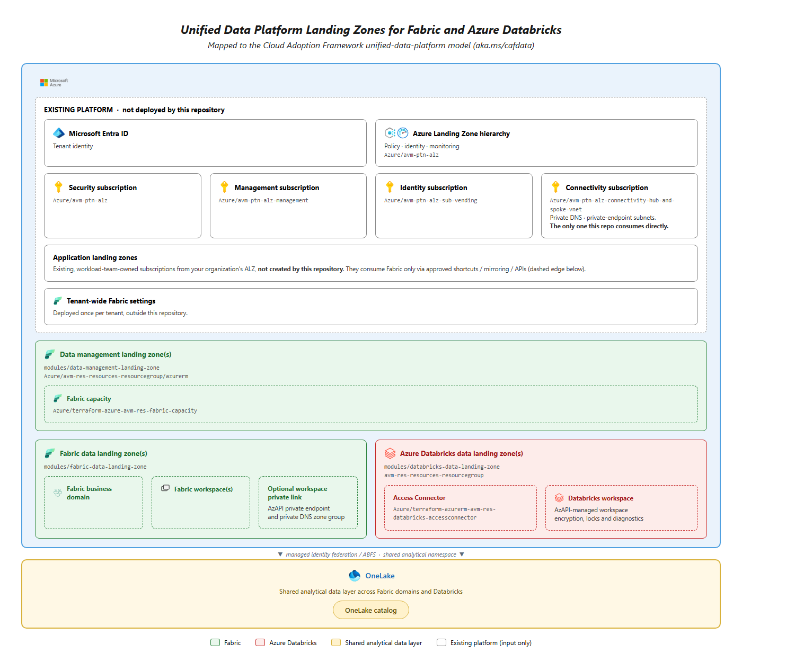

# Unified Data Platform Landing Zones for Fabric and Azure Databricks

Terraform pattern module for establishing security-first Microsoft Fabric and Azure Databricks landing zones with OneLake as the shared analytical data layer.

## Architecture

This design implements the Cloud Adoption Framework's [layered landing-zone model for a unified data platform](https://learn.microsoft.com/en-us/azure/cloud-adoption-framework/data/architecture-azure-landing-zones-unify-data-platform): an existing ALZ platform hosts one or more data management landing zones (DMLZ) for Fabric capacity, sibling data landing zones (DLZ) for Fabric domains/workspaces and for Azure Databricks, and OneLake as the shared analytical layer between them. Fabric tenant governance (tenant-wide Fabric settings) is a prerequisite configured once per tenant, outside this module.



Green boxes are the Fabric side of this repository, red boxes are the Azure Databricks side, gold is the shared OneLake analytical layer, and white/grey boxes are existing ALZ platform components consumed as inputs (resource-group IDs, subnet IDs, private DNS zone IDs) rather than recreated. See [docs/architecture.md](docs/architecture.md) for the full reasoning behind each boundary.

## What It Deploys

- Azure resource groups, Fabric capacities, and capacity locks/RBAC in one or more data management landing zones.
- Fabric domains and workspaces as delegated business-domain boundaries.
- Workspace system-assigned identities and parameterized Fabric RBAC.
- Optional deny-by-default outbound controls and two-phase inbound lockdown after workspace private-link verification.
- Optional workspace-level private link using `Microsoft.Fabric/privateLinkServicesForFabric`, an Azure private endpoint, and the ALZ shared private DNS zone.
- Optional managed private endpoints and explicit cloud/gateway connection allowlists.
- Workspace Git outbound policy that defaults to `Allow` for source-control integration and supports an explicit `Deny` override.
- Optional Fabric workspace customer-managed-key encryption (`fabric_workspace_encryption`, preview) using an existing Azure Key Vault key.
- A sibling Azure Databricks data landing zone with VNet injection, configurable secure cluster connectivity, optional CMK, locks, diagnostics, and a managed-identity Access Connector for OneLake federation.
- Parameterized OneLake workspace/item GUIDs and global, regional, or workspace-private DFS hosts; no duplicate ADLS analytical data lake or credentials are created.

It intentionally does not deploy data products, Fabric workload items, Databricks compute, notebooks, jobs, or Unity Catalog objects. See [docs/architecture.md](docs/architecture.md) for the boundary and reasoning.

## Structure

| Path | Responsibility |
| --- | --- |
| Root module | Composes mandatory Fabric/OneLake landing zones with optional Azure Databricks landing zones |
| `modules/data-management-landing-zone` | Published AVM resource group and standalone Fabric capacity |
| `avm-res-fabric-capacity` | Published AVM resource module for `Microsoft.Fabric/capacities`. Consumed here as a pinned registry module (v0.1.0). |
| `modules/fabric-data-landing-zone` | Fabric domain, workspaces, RBAC, identities, network policy, and workspace-level private link |
| `Microsoft.Network/privateEndpoints` | Workspace private endpoints and DNS zone groups managed directly through AzAPI in the Fabric data landing zone |
| `avm-res-databricks-accessconnector` | Published AVM resource module for `Microsoft.Databricks/accessConnectors`. Consumed here as a pinned registry module (v0.1.0). |
| `modules/databricks-data-landing-zone` | VNet-injected Databricks workspace composition, diagnostics, and OneLake contract |
| `examples/default` | Minimum required inputs: one capacity, one business domain, one workspace |
| `examples/secure-baseline` | Workspace-level private link with example-owned network and private DNS prerequisites |
| `examples/databricks-onelake-baseline` | Unified Fabric, OneLake, and VNet-injected Azure Databricks deployment |

Every example deploys without any input, as `avm test e2e` requires: each creates its own prerequisites with AzAPI and derives the tenant and subscription from the provider configuration.

## Provider Policy (TFFR3)

Per [TFFR3](https://azure.github.io/Azure-Verified-Modules/spec/TFFR3/), every Azure control-plane operation in this repository uses AzAPI. Databricks workspaces, encryption bindings, locks, diagnostic settings, and Fabric workspace private endpoints are owned by this pattern, rather than delegated to dependencies that require AzureRM. Fabric API operations use the permitted Microsoft Fabric provider.

Per [TFNFR26](https://azure.github.io/Azure-Verified-Modules/spec/TFNFR26/), each scope declares only providers it uses directly. No root, submodule, example, or test fixture declares or configures AzureRM, and there is no AzureRM lint-policy waiver. Existing Registry addresses ending in `/azurerm` are module system identifiers, not provider declarations; the retained resource-group and Access Connector dependencies use AzAPI internally. Unit tests explicitly map any mocks required by composed dependencies.

The remaining telemetry specification/tooling rollout gap is documented under [Current Gaps](#current-gaps); it is not a provider-policy exception.

## Prerequisites

1. Terraform `>= 1.12, < 2.0`, including compatibility with the retained Fabric capacity dependency's short-circuiting optional-lock validation. The minimum version is covered by the unit suites and CI.
2. AzAPI `>= 2.12, < 3.0`, Microsoft Fabric `>= 1.14, < 2.0`, modtm `~> 0.3`, random `~> 3.5`, and time `~> 0.9`. The released AVM telemetry generator still requires modtm and random pending the SFR3 rollout described below. Examples also use random for unique names.
3. Azure permissions on every supplied full resource-group, subnet, and DNS-zone resource ID. Existing resource-group IDs retain their subscription in both the Databricks workspace/Access Connector and the Fabric private-link service/endpoint; they are not reduced to a name and retargeted to the ambient subscription. New resource groups are created in the configured AzAPI subscription.
4. For workspace-level private link in production: an existing ALZ hierarchy, connectivity subscription, private-endpoint subnet, and shared `privatelink.fabric.microsoft.com` private DNS zone. `examples/secure-baseline` creates stand-ins for these.
5. `Microsoft.Fabric` registered or re-registered in subscriptions that host Fabric private-link resources, and `Microsoft.Network` re-registered where workspace outbound access protection is used.
6. A deployment identity that is a Fabric administrator, because creating Fabric domains requires it, and that is a capacity administrator of each capacity its workspaces are assigned to. The examples make the deploying identity the capacity administrator by default.
7. The following Fabric tenant settings, enabled by a Fabric administrator before deploying. This module does not configure tenant settings.
   - Service principals can call Fabric public APIs, required for a service-principal deployment identity to authenticate to the Fabric API.
   - Configure workspace-level inbound network rules, required for workspace-level private link.
   - Configure workspace-level outbound network rules, required for `enable_network_restrictions`.
   - Users can access data stored in OneLake with apps external to Fabric, required for Azure Databricks to reach OneLake through the Access Connector's managed identity.
   - Use short-lived user-delegated SAS tokens and Authenticate with OneLake user-delegated SAS tokens, required only for direct ABFS read/write instead of read-only OneLake catalog federation.
8. A nontrial Fabric F SKU in a supported region.
9. Least-privilege deployment identities. Use OIDC or managed identity in automation. The Fabric provider does not read `ARM_*` variables; the examples' `pre.ps1` hooks map an OIDC or managed-identity `ARM_*` identity onto the Fabric provider (see [docs/e2e-testing.md](docs/e2e-testing.md)).
10. For Databricks: a caller-managed VNet with two dedicated delegated subnets and NSGs, explicit outbound connectivity, a Premium workspace SKU, and existing Fabric Lakehouse or Warehouse GUIDs.
11. For Databricks customer-managed keys: versioned Azure Key Vault key URLs (`https://<vault>.vault.azure.net/keys/<name>/<version>`) for the managed-disk and managed-services keys, which the Databricks workspace encryption API requires; the root DBFS key accepts a versioned or versionless URL. Grant **Key Vault Crypto Service Encryption User**, or get/wrapKey/unwrapKey, to the identity each surface uses:
    - **Root DBFS:** the workspace storage account identity, which Databricks creates only when the workspace is prepared for encryption; the key must be usable before it is bound. Set `customer_managed_key.dbfs_root_key_role_assignment.key_vault_resource_id` to let the zone grant this on the key between those steps in one apply (Azure RBAC vaults; the deploying identity needs `Microsoft.Authorization/roleAssignments/write` on the key). Otherwise the first apply prepares the workspace but cannot bind the key; grant access and apply again. [docs/security.md](docs/security.md) covers existing grants, key or vault changes, and removing the grant.
    - **Managed disks:** the disk encryption set identity (`workspace_managed_disk_identity`), after the workspace is created.
    - **Managed services:** the AzureDatabricks first-party application, before the workspace is created.
12. For OneLake federation: Unity Catalog, supported compute, and Fabric access for the Access Connector principal.
13. For Fabric workspace CMK: enable the tenant setting **Apply customer-managed keys**, create the **Fabric Platform CMK** service principal (application ID `61d6811f-7544-4e75-a1e6-1c59c0383311`) in the Fabric tenant, and grant that principal **Key Vault Crypto Service Encryption User** or equivalent get/wrapKey/unwrapKey permissions on the key vault. Supply a versionless RSA/RSA-HSM key identifier from a vault with soft delete and purge protection enabled. The root Fabric provider must set `preview = true`; `fabric_workspace_encryption` is a preview provider resource. See [Microsoft's CMK setup instructions](https://learn.microsoft.com/fabric/security/workspace-customer-managed-keys).

## Validate

```powershell
Install-PSResource Avm.Authoring
Import-Module Avm.Authoring
avm pre-commit
avm test unit
avm pr-check
```

`avm pre-commit` synchronizes the AVM managed files, applies convention fixes, formats, and regenerates every README. `avm test unit` runs the mocked unit suites of the root module and each `modules/*` submodule. `avm pr-check` runs the full pull-request gate and needs Azure credentials because its policy step plans the examples. `avm test integration` deploys real resources: it runs the Databricks root DBFS customer-managed key test described in [docs/e2e-testing.md](docs/e2e-testing.md). Each example also has an input-free plan test, which `avm test unit` does not run:

```shell
terraform init -backend=false
terraform validate
terraform test -test-directory=tests/unit
```

Run these in each `examples/*` directory. Unit suites live under `tests/unit/`; plain `terraform test` only searches `tests/` itself and would discover none. Credentialed deployment, idempotency, and cleanup testing is described in [docs/e2e-testing.md](docs/e2e-testing.md).

Deployment sequencing, lockout prevention, and the state-migration requirements for deployments created from pre-release source are covered in [docs/deployment.md](docs/deployment.md). Security decisions are in [docs/security.md](docs/security.md).

## Current Gaps

### Verification gaps

This module does not automatically prove private-endpoint approval, DNS resolution from every authorized network, or successful client access before lockdown; `private_link_ready_for_lockdown` is a reviewed operator attestation.

Capacity discovery through the Fabric API can also lag immediately after Azure capacity creation. The root module waits `capacity_activation_wait_duration` (default 30 seconds) after each capacity is created, using the same `hashicorp/time` `time_sleep` pattern other AVM modules use for eventual-consistency delays, then looks the capacity up through the Fabric provider's recommended [`fabric_capacity` postcondition pattern](https://registry.terraform.io/providers/microsoft/fabric/1.13.0/docs/data-sources/capacity). If propagation still exceeds the configured wait, the postcondition fails with a clear, actionable message instead of hiding the delay behind arbitrary local-exec polling.

### AVM publication path

- The Fabric capacity dependency is published on the Terraform Registry at [`Azure/avm-res-fabric-capacity/azure` v0.1.0](https://registry.terraform.io/modules/Azure/avm-res-fabric-capacity/azure/0.1.0). This pattern module consumes it as a pinned Terraform Registry module (`azure/avm-res-fabric-capacity/azure`, version `0.1.0`).
- The Databricks Access Connector dependency is published on the Terraform Registry at [`Azure/avm-res-databricks-accessconnector/azurerm` v0.1.0](https://registry.terraform.io/modules/Azure/avm-res-databricks-accessconnector/azurerm/0.1.0). `modules/databricks-data-landing-zone` consumes it as a pinned Terraform Registry module (`Azure/avm-res-databricks-accessconnector/azurerm`, version `0.1.0`).

The module proposal is [Azure/Azure-Verified-Modules#2877](https://github.com/Azure/Azure-Verified-Modules/issues/2877). The root `metadata.json` holds the values assigned when the AVM repository was created. The three child `metadata.json` files still use explicitly unassigned telemetry placeholders (`46d3xtrf.ptn.unassigned-*`) and proposed `canonicalType` paths. The AVM core team must confirm or assign these values before the first release, as the [module metadata process](https://azure.github.io/Azure-Verified-Modules/contributing/module-metadata/) requires. Do not hand-pick identifiers or present these placeholders as assigned.

### Telemetry tooling rollout blocker

[SFR3](https://azure.github.io/Azure-Verified-Modules/spec/SFR3/) changed on 29 September 2026 to require metadata-backed subscription-scoped AzAPI deployment telemetry instead of `modtm`. The latest published `Avm.Authoring` 0.19.0 and its managed transforms still implement the older `modtm` design; the replacement generator is tracked in [AVM tools PR #192](https://github.com/Azure/azure-verified-modules-tools/pull/192). The repository retains the official released generator rather than vendoring an unmerged implementation or suppressing its checks. Passing those checks is not evidence of SFR3 compliance. Migration to the released replacement and approved metadata remains a publication blocker.

The root and every Azure-deploying local child expose `location` for SFR4. The root uses this reporting region without replacing the independently configured landing-zone and private-endpoint locations. The generated telemetry implementation must be refreshed with the official supported tooling when the rollout is available.

### AzAPI interface limitation

The separate root-DBFS binding preserves the Databricks prepare-identity-then-bind lifecycle using `azapi_update_resource`. AzAPI 2.12/2.13 expose retries and timeouts on this type but not `ignore_body_changes`, although current TFFR8 lists the type as applicable. The workspace's ignore-body paths do not apply to this update node. Resolve this provider/specification gap with AzAPI/AVM rather than passing an unsupported argument or claiming full compliance. The workspace resource itself never sends `parameters.encryption`: Azure rejects it in the create request, and a later workspace update that omits it keeps the existing binding, which the integration test verifies. The pinned resource-group dependency also predates the resource-type and ignore-body override interfaces; that implementation is owned by its upstream repository.

### Deferred scope

Databricks front-end/back-end Private Link and Unity Catalog object provisioning are future, separately testable additions.

### Deployment-time governance checks

Region/SKU compatibility, subnet capacity, explicit outbound connectivity, destination private-endpoint approval, monitoring, and DR remain deployment-time governance checks because they are tenant-, region-, or workload-dependent.

## Known Tooling Warning

Terraform tests can report that `azapi_resource.retry.multiplier` is deprecated when a module exposes the complete AzAPI resource object. The modules do not configure `multiplier`; it remains present in the AzAPI provider's computed resource schema and is traversed while rendering the AVM-style `resource` output. Removing that output would weaken the resource-module contract, so this warning is tracked as upstream provider/tooling behavior and is not suppressed locally.